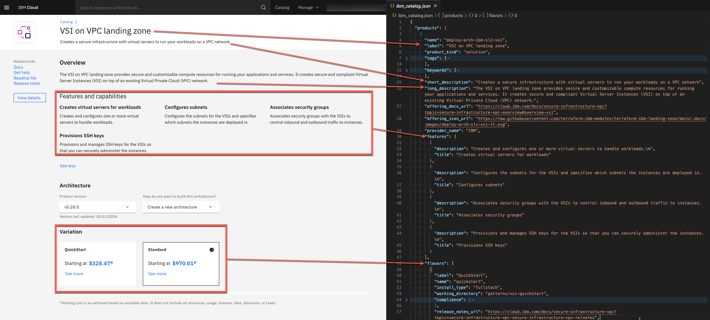
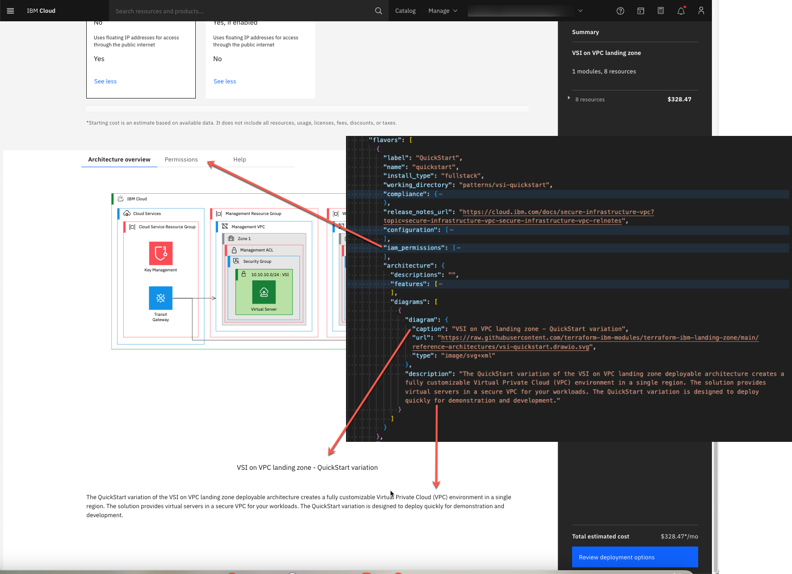
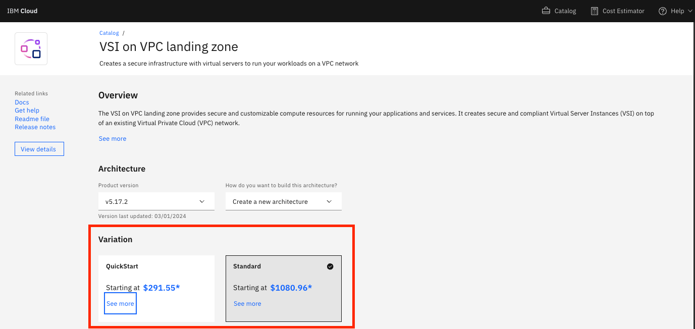

---

copyright:
   years: 2024
lastupdated: "2024-05-17"

keywords:

subcollection: secure-enterprise

---

{{site.data.keyword.attribute-definition-list}}

# Creating a deployable architecture
{: #create-da}

After going through the steps to [plan and design your architecture](/docs/secure-enterprise?topic=secure-enterprise-starting-da-process) and [decide what type of component to create](/docs/secure-enterprise?topic=secure-enterprise-choose-plan-process), you can start creating the automated code that brings the architecture to life. This topic guides you through creating a deployable architecture that is made of modules.
{: shortdesc}

To create a deployable architecture, you must define the required files, create a release in GitHub, and then onboard it to a private catalog so that you can share it with others inside or outside of your organization.

You can choose to build your own deployable architecture with Terraform following these instructions, or you can choose to [download the code from an existing architecture](/docs/secure-enterprise?topic=secure-enterprise-customize-from-catalog) to modify it to fit your needs and create a new deployable architecture with your changes. If you are looking to create a deployable architecture stack, which is made up of a group of deployable architectures, see [Stacking deployable architectures](/docs/secure-enterprise?topic=secure-enterprise-config-stack).
{: note}

## Learn about the structure of a deployable architecture
{: #da-anatomy}

A deployable architecture, which this documentation describes, is made up of 1 or more modules. A deployable architecture is composed of the following in the source repo:

{: caption="Figure 1. Anatomy of a terraform-based deployable architecture" caption-side="bottom"}

Terraform code
:   Your source repo includes [Terraform files](#required-files). These files declare the desired infrastructure (end-state) and rely on Terraform providers that perform the actual API requests to create, update, and delete the infrastructure. Some of the most common providers used are {{site.data.keyword.cloud}} Terraform provider and Helm/Kubernetes/Rest API provider.

Scripts (optional)
:   Used as a stop gap for functions that might not exist (Bash/Python) or for ad hoc operational tasks (Ansible). For more information, see [Creating scripts for deployable architectures](/docs/secure-enterprise?topic=secure-enterprise-understand-scripts).

Automated tests
:   Validation tests that are used to deploy, verify, and destroy infrastructure. For an example, see the `tests` directory in the [sample-deployable-architectures](https://github.com/terraform-ibm-modules/sample-deployable-architectures/tree/main){: external} sample repo.

Documentation
:   An architecture diagram and readme file need to be included in your source repo.

Catalog manifest file
:   Defines how the deployable architecture is exposed in the {{site.data.keyword.cloud_notm}} catalog. In addition to the general catalog details like the name, description, and features, it includes the variation definitions that point to the underlying Terraform configuration, compliance claims that are verified during onboarding to the catalog by using {{site.data.keyword.compliance_full}}, and necessary IAM permissions for running the deployable architecture. For more information, see [Locally editing the catalog manifest](/docs/secure-enterprise?topic=secure-enterprise-manifest-values&interface=ui#example-manifest).

Variations
:   A deployable architecture can include variations of capability or complexity. For example, you might create a quick start variation with basic capabilities for a simple, low-cost deployment, and then you might have a standard variation with a more complex architecture that would be used in production. Each of these variations is itself a deployable architecture, which is onboarded and configured to appear together in a catalog. These variations are sourced in the same repo in different working directories and are defined in your `ibm_catalog.json` file. For more information, see [Creating a variation](#create-variation).

## Determining if you have dependencies
{: #fullstackvext}

There are two `install_type` options that you can specify when creating your deployable architecture. One specifies that dependent deployable architectures that must be deployed first, and one specifies that it can be deployed without any prerequisites.

`fullstack`
:   It is a full end-to-end solution that is always deployed as-is. The `fullstack` value is set in the `ibm_catalog.json` manifest file for `install_type` to specify that the deployable architecture does not have any dependencies (prerequisites).

`extension`
:   A deployable architecture that depends on another deployable architecture being deployed first. The prerequisite deployable architecture is the base on which the extension deployable architecture is built. This dependency, or prerequisite, must be met to deploy the extension. The `extension` value is set in the `ibm_catalog.json` manifest file for the `install_type`, and the `dependencies` array must be completed to specify the dependent deployable architecture in the manifest file.

For more information and setting these values, see [Locally editing the catalog manifest](/docs/secure-enterprise?topic=secure-enterprise-manifest-values).


## Creating a deployable architecture
{: #creating-da}

You can expect to complete the following high-level tasks while creating your deployable architecture:

1. Create your source repo and add your code.
1. Create your `ibm_catalog.json` manifest file to prepare for creating a tile in the catalog.
1. Create a release.
1. Onboard your code to a create a catalog tile in a private catalog by reviewing and validating it.
1. Choose where you want to share or publish your deployable architecture.

The following instructions for creating a deployable architecture use a public sample repo to teach by example.
{: note}

### Creating your source repo
{: #source-repo-da}

By using the requirements that are defined by your organization, create a GitHub repository that you can use to hold the source code for your deployable architecture. For help with creating a repository, see the [GitHub documentation](https://docs.github.com/en/repositories/creating-and-managing-repositories/quickstart-for-repositories){: external}. If you already have a repository that you want to use, you can skip this step. You can choose to use another organization to host your source code, such as GitLab, but for purposes of this documentation, GitHub is used.

### Creating the required Terraform files
{: #required-files}

Review the following sections to understand which base Terraform files are required in your GitHub source repo to create the `.tgz` file that is required as part of onboarding your deployable architecture to a private catalog.

#### `main.tf`
{: #main}

The `main.tf` file is where you place the code that provisions the resources that you want to create. You can call a module from [`terraform-ibm-modules`](https://github.com/terraform-ibm-modules/){: external} or an external module or a provider resource directly.

See examples:
- [Deployable architecture without dependencies `main.tf`](https://github.com/terraform-ibm-modules/sample-deployable-architectures/blob/main/solutions/tf-fullstack-da/main.tf){: external}
- [Deployable architecture with dependencies `main.tf`](https://github.com/terraform-ibm-modules/sample-deployable-architectures/blob/main/solutions/tf-extension-da/main.tf){: external}


#### `outputs.tf`
{: #outputs}

The `outputs.tf` file contains output values that you can include in your deployable architecture.

See examples:
- [Deployable architecture without dependencies `outputs.tf`](https://github.com/terraform-ibm-modules/sample-deployable-architectures/blob/main/solutions/tf-fullstack-da/outputs.tf){: external}
- [Deployable architecture with dependencies `outputs.tf`](https://github.com/terraform-ibm-modules/sample-deployable-architectures/blob/main/solutions/tf-extension-da/outputs.tf){: external}


#### `provider.tf`
{: #provider}

The provider.tf file contains the provider configuration such as the provider name, API key, and region that the code expects.

See examples:
- [Deployable architecture without dependencies `provider.tf`](https://github.com/terraform-ibm-modules/sample-deployable-architectures/blob/main/solutions/tf-fullstack-da/provider.tf){: external}
- [Deployable architecture with dependencies `provider.tf`](https://github.com/terraform-ibm-modules/sample-deployable-architectures/blob/main/solutions/tf-extension-da/provider.tf){: external}


#### `README.md`
{: #readme-files}

The readme file contains background and usage information about the deployable architecture, including a requirements, modules, resources, required access, inputs, and outputs sections.

If you're source repo is in the `terraform-ibm-modules` org, most of the readme file is generated. So you don’t manually add the information like the inputs and outputs. Variable names and descriptions are generated into the readme file from the variables.tf file.
{: tip}

See examples:
- [Deployable architecture without dependencies `README.md`](https://github.com/terraform-ibm-modules/sample-deployable-architectures/blob/main/solutions/tf-fullstack-da/README.md){: external}
- [Deployable architecture with dependencies `README.md`](https://github.com/terraform-ibm-modules/sample-deployable-architectures/blob/main/solutions/tf-extension-da/README.md){: external}


#### `variables.tf`
{: #variables}

The `variables.tf` file includes the required and optional variables for the deployable architecture.

See examples:
- [Deployable architecture without dependencies `variables.tf`](https://github.com/terraform-ibm-modules/sample-deployable-architectures/blob/main/solutions/tf-fullstack-da/variables.tf){: external}
- [Deployable architecture with dependencies `variables.tf`](https://github.com/terraform-ibm-modules/sample-deployable-architectures/blob/main/solutions/tf-extension-da/variables.tf){: external}

#### `version.tf`
{: #version-tf}

The `version.tf` file stores information about the Terraform version and provider version that is needed to run the deployable architecture.

Any required Terraform providers for the deployable architecture should be locked into an exact version instead of using a range to ensure consistent results with the deployable architecture.
{: important}

See examples:
- [Deployable architecture without dependencies `version.tf`](https://github.com/terraform-ibm-modules/sample-deployable-architectures/blob/main/solutions/tf-fullstack-da/version.tf){: external}
- [Deployable architecture with dependencies `version.tf`](https://github.com/terraform-ibm-modules/sample-deployable-architectures/blob/main/solutions/tf-extension-da/version.tf){: external}

### Creating a catalog manifest file
{: #create-manifest}

The catalog manifest is a file in the root of your repository that is called the `ibm_catalog.json`. This file defines the required metadata for creating a tile in a catalog, for example the name, description, features, variation definitions that point to the underlying Terraform configuration, compliance claims that will be verified during onboarding by using {{site.data.keyword.compliance_short}}, and necessary IAM permissions for deploying the architecture. It also defines the configurations that you want to be selected by default when a user attempts to deploy your architecture from the catalog.

Check out the [example from the sample repo](https://github.com/terraform-ibm-modules/sample-deployable-architectures/blob/main/ibm_catalog.json){: external} that shows a fullstack and extension type variation.
{: tip}

You can create your catalog manifest file by using two different methods:

1. You can create this file from scratch by using the [template](/docs/secure-enterprise?topic=secure-enterprise-manifest-values&interface=ui#example-manifest). .
1. You can start the onboarding process with the following basic sample in your source repo, and then [download the manifest file](/docs/secure-enterprise?topic=secure-enterprise-onboard-da&interface=ui#download-manifest) after you make changes during onboarding in the console to add the updated file to your source repo.

   The following is a basic manifest file that you can add to your repository and edit to help to get you started with this option.

   ```json
   {
       "products": [
           {
               "flavors": [
                   {
                       "architecture": {},
                       "compliance": {},
                       "install_type": "fullstack"
                   }
               ],
               "label": "catalog-create-sample-da-0.0.1",
               "name": "catalog-create-sample-da-0.0.1",
               "offering_icon_url": "url",
               "product_kind": "solution",
               "provider_name": "Community",
               "short_description": "A simple deployable architecture.",
               "tags": [
                   "dev_ops"
               ],
               "version": "0.0.1"
           }
       ]
   }
   ```
   {: codeblock}

#### Mapping catalog details to the manifest file
{: #mapping-manifest}

To help visualize how the content added to the manifest file is displayed to users, see the following examples that show the relationship between the `ibm_catalog.json` and the catalog details page.

Let's look at how the deployable architecture name, description, features, and variations are defined in the catalog manifest file and how the user sees the information on the catalog details page.

{: caption="Figure 2. Deployable architecture title, description, features text mapping to the source file" caption-side="bottom"}

Let's look at how the variation features list is used to help users compare variations based on how it's defined in the catalog manifest file.

{: caption="Figure 3. Deployable architecture variation feature comparison" caption-side="bottom"}

Let's look at where the permissions and architecture diagram details are specified in the catalog manifest file and how it's displayed on the catalog details page.

{: caption="Figure 4. Deployable architecture permissions and architecture text mapping to the source file" caption-side="bottom"}

And, if your architecture meets a specific level of compliance that is verified with a scan by using the {{site.data.keyword.compliance_short}}, you can add a compliance claim per variation. You define how your architecture meets a certain level of compliance in the `ibm_catalog.json` file by specifying the {{site.data.keyword.compliance_short}} profile. You must also run a scan on the resources that your architecture creates before onboarding to {{site.data.keyword.cloud_notm}}. For more information, see [Managing compliance information for your deployable architecture](/docs/secure-enterprise?topic=secure-enterprise-format-controls).

See in the following example how the compliance information that is defined in the manifest file is displayed to users.

{: caption="Figure 5. Deployable architecture compliance" caption-side="bottom"}

## Creating a variation
{: #create-variation}

A deployable architecture can include variations of capability or complexity. A variation is a new version of your architecture that is designed to build upon the functions of the core architecture pattern. For example, you might create a quick start variation with basic capabilities for a simple, low-cost deployment, and then you might have a standard variation with a more complex architecture that would be used in production. Each of these variations is itself a deployable architecture that is onboarded and configured to appear as options for the same tile in the catalog.

The variations of the core architecture often vary in the following key areas:

* Cost
* Compliance
* Complexity in time and use
* It deploys something different for a specific use case, but solves the same overall business problem.

Here's an example of a deployable architecture with two variations in the catalog. These are two variations that use the same source URL, product name, and version during onboarding to the catalog to ensure that they show up side by side after a user selects the catalog tile:

{: caption="Figure 6. Deployable architecture with two variations" caption-side="bottom"}

To create an additional variation of the deployable architecture that you already created, complete the following steps:

1. In your source code repo, create a working directory and add the [required Terraform files for a deployable architecture](#required-files).
1. In the manifest file, add the following code snippet into the `flavors` section. This array defines the offering as part of the same deployable architecture, but allows it to be listed as a variation within the catalog. If you [downloaded your manifest from a previously onboarded](/docs/secure-enterprise?topic=secure-enterprise-onboard-da#download-manifest) version in the catalog, the file will already have a minimal definition in place for a new variation.

   For example, if your deployable architecture is called `Dinner` and you want to create a variation of that, you might call it `steak` as shown in the following example.

   ```json
   "flavors": [
    {
        "label": "Steak",
        "name": "steak-variation",
        "working_directory": "./steak",
        "install_type": "fullstack"
    }
   ]
   ```
   {: codeblock}

   The updated catalog manifest file that you upload as part of your release auto-fills most of the configurations for your new variation. However, it is a best practice to validate the configuration before you share the product with your organization.
   {: tip}

You can repeat these steps if you have additional variations to add. When you're done, you can create your Git release and start onboarding to a private catalog to create a catalog tile that you can share with others.


## Next steps: Onboard your deployable architecture to a private catalog
{: #catalog-tile}

With a Git release created that includes the required files in your source repo, you can onboard a version of your deployable architecture and all included variations. Onboarding is the process of creating a catalog tile in a private catalog by reviewing the catalog details and validating a test deployment and the compliance claims in {{site.data.keyword.cloud_notm}}. For the step-by-step process, see [Onboarding deployable architectures](/docs/secure-enterprise?topic=secure-enterprise-onboard-da).
